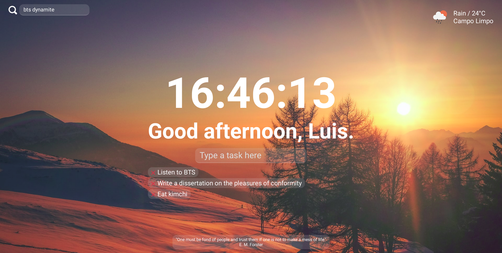

# [Nomad Coders - Nomentum](https://nomadcoders.co/javascript-for-beginners)

<p align="center">
  
</p>

## Table of Contents

- [About](#about)
- [Features](#features)
- [Getting Started](#getting_started)
- [License](#license)
- [Packages](#packages)
- [Docs](#docs)
- [Resources](#resources)

## About <a name = "about"></a>

A Momentum clone with vanilla Javascript.

- Production App: https://nomentum.herokuapp.com
- [Take the course too!](https://nomadcoders.co/javascript-for-beginners)
- [Certificate of Completion](https://nomadcoders.co/certs/5be235d7-9445-42b8-9de5-be8da41cc084)

I have since rebuilt this app with Next.JS and added more features:

- https://github.com/librity/impetus
- https://impetus.vercel.app/

## Features <a name = "features"></a>

- [x] NO TRACKING EVER!!!
  - [x] Serve roboto font
- [x] Clock
- [x] Greeting
  - [x] Updates with time 
- [x] Landscape background
  - [x] Random landscape from unsplash
- [x] Tasks
  - [x] Add task
  - [x] Save tasks to local storage
  - [x] Delete task
- [x] Weather
  - [x] Current weather with icon
- [x] Search bar
  - [x] DuckDuckGo

## Getting Started <a name = "getting_started"></a>

### Prerequisites

- `node >= 14.0.0`

### Installation

1. Clone this repo locally and install the required packages:

```bash
$ git clone https://github.com/librity/nc_js101.git
$ cd nc_js101
$ npm install
```

2. Start a development server:

```bash
$ npm run dev
```

3. Open http://localhost:3000 on your web browser.

#### Format

Format all source files with Prettier:

```bash
$ npm run format
```

## License <a name = "license"></a>

This project is [MIT licensed](LICENSE).

## Packages <a name = "packages"></a>

- https://github.com/remy/nodemon/
- https://github.com/babel/babel
- https://github.com/expressjs/express

## Docs <a name = "docs"></a>

- https://babeljs.io/docs/en/
- https://expressjs.com/en/guide/routing.html

## Resources <a name = "resources"></a>

- https://fonts.google.com/specimen/Roboto
- https://github.com/alvarotrigo/fullpage.js
- https://github.com/serranoarevalo/momonton

### Javascript

- https://codeforgeek.com/render-html-file-expressjs/
- https://stackoverflow.com/questions/18621612/find-and-remove-element-from-array
- https://www.delftstack.com/howto/javascript/javascript-float-to-int/
- https://stackoverflow.com/questions/2696692/setinterval-vs-settimeout
- https://stackoverflow.com/questions/55362152/how-to-open-a-new-tab-in-javascript

### Fetch Request

- https://stackoverflow.com/questions/247483/http-get-request-in-javascript
- https://gist.github.com/msmfsd/fca50ab095b795eb39739e8c4357a808
- https://fetch.spec.whatwg.org/

### Quotes API

- https://github.com/lukePeavey/quotable
- https://api.quotable.io/random

### Backgrounds API

- https://awik.io/generate-random-images-unsplash-without-using-api/
- https://unsplash.com/developers

### Weather API

- https://openweathermap.org/current
- https://openweathermap.org/weather-conditions

### CSS

- https://www.w3schools.com/cssref/func_linear-gradient.asp
- https://www.w3schools.com/cssref/pr_background-image.asp
- https://developer.mozilla.org/en-US/docs/Web/CSS/background-image
- https://stackoverflow.com/questions/6338217/get-a-css-value-with-javascript
- https://cssgradient.io/gradient-backgrounds/
- https://stackoverflow.com/questions/4847850/is-it-possible-to-define-constants-in-css
- https://stackoverflow.com/questions/5195303/set-css-property-in-javascript
- https://stackoverflow.com/questions/11757537/css-image-size-how-to-fill-but-not-stretch
- https://www.educba.com/css-text-outline/
- https://www.w3docs.com/snippets/css/how-to-set-space-between-flexbox-items.html
- https://www.w3schools.com/css/css_text_align.asp
- https://www.w3schools.com/CSSref/css3_pr_opacity.asp
- https://stackoverflow.com/questions/16989585/css-3-slide-in-from-left-transition
- https://www.w3schools.com/cssref/sel_focus.asp
- https://marksheet.io/css-priority.html
- https://www.w3schools.com/csS/css_overflow.asp
